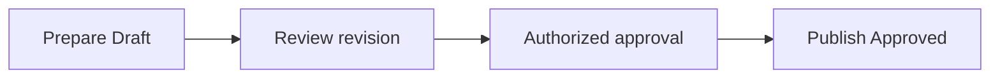

# Contributing

This guide covers repository organization, document types, lifecycle, review, and approval. The [README](README.md) provides the repository overview and document index.

## Repository Management

The [glossary](CONTEXT.md) defines shared vocabulary, and the [document format](.docs/document-format.md) defines metadata fields and templates.
The `.docs/` directory holds repository metadata, including documentation rules, templates, and Markdown lint configuration. Keep these files in Git alongside the content they govern.

Organize content by area, and group a topic in its own folder when it has several related documents: `area/topic/documents`, such as `delivery/jira/`.
Create area and topic folders only when content justifies them. A topic may contain Visions, Standards, Designs, Guidance, Checklists, and review records; type and status remain metadata.
Keep each requirement or decision in one canonical source and reference it from related documents.
Use repository-relative paths for internal links and stable shared URLs for external sources. Never hardcode local machine paths.
If a shared source URL is unavailable, identify the document by title and filename. A topic can have several documents with distinct purposes.
Keep each document in the area responsible for its primary subject; link to it from related areas instead of copying requirements.
For example, Integration can reference Security's authentication requirements and add API-specific rules.

### Path and filename convention

Use `<area>/<topic>/<specific-subject-or-purpose>.md`. Content paths use lowercase kebab-case. A filename describes its subject or purpose; metadata carries document type, status, and version.
Do not use generic filenames such as `design.md`, or append `-standard`, `-design`, `-guidance`, `-checklist`, version, or status merely to repeat metadata.
Create a topic folder when it owns several documents. Root repository metadata keeps its conventional names, such as `README.md`, `CONTRIBUTING.md`, and `CONTEXT.md`.

`PLAYBOOKS/` is the single deliberate uppercase directory. It is the human entry point for practical, reusable application of the foundation documents. Its child directories and files remain lowercase kebab-case.
Playbooks are Guidance or Checklists: they apply canonical requirements and Designs through scenario recommendations, alternatives, worked flows and expected evidence without creating independent obligations.
Use the [practical guidance format](.docs/document-format.md#practical-guidance-and-usability-review); introduce or change a shared design choice in its canonical Design before explaining it in a playbook.
Service-specific answers and evidence remain in their owning development, infrastructure, delivery, or corporate systems.

## Document Types

| Type | Purpose |
| --- | --- |
| Vision | Describes the problem, desired outcomes, scope, and proposed direction that can inform Designs or Standards. |
| Standard | Defines requirements, recommendations, and permissions within a stated scope. |
| Design | Describes a particular solution's scope, structure, behaviour, responsibilities, constraints, and acceptance criteria. |
| Guidance | Explains how to apply standards and links to the relevant requirements. |
| Checklist | Verifies requirements through checks and evidence, with links to their sources. |
| Catalog | Lists technologies or contracts with ownership and lifecycle information; links to governing standards. |

Guidance and checklists do not introduce independent obligations. A catalog design document has type Design; the inventory it describes is the Catalog. A Design follows governing Standards and may be Draft, Proposed, Approved, or Retired.
A Vision can lead to one or more Designs or Standards. Keep their distinct purposes and link them; approval of a Vision accepts direction, not the resulting implementation or rules.
Each resulting document follows its own review and approval lifecycle. A Vision is optional when the problem and direction are already clear.

Technology Catalog remains an area for technology choices; other catalogs belong in their relevant subject areas.

A review record is the single authoritative history of feedback, revisions, dispositions, and approval references.
Prefer the pull request for feedback on a concrete revision and an issue for feedback raised before a revision exists or spanning revisions.
Create `<document-name>-review.md` beside a document only when no suitable authoritative pull request or issue record is available.
Link the chosen record instead of copying its discussion into another ledger. A review record uses the comment states below; it does not have a standard's approval status.

## Document Lifecycle

All governed document types use these statuses. Approved documents carry the [required approval evidence](.docs/document-format.md#conditional-fields).

| Status | Meaning |
| --- | --- |
| Draft | Being written; not approved. |
| Proposed | Ready for review; not approved. |
| Approved | Accepted by the authorized approver for its stated scope. |
| Retired | No longer applicable; identifies its replacement when one exists. |

The owner maintains the document and resolves feedback. The authorized approver decides whether a revision can become Approved; ownership alone does not establish approval authority.
An open comment or a delayed review does not automatically revoke approval. The owner must assess the document and record the outcome.

## Normative Language

The terms MUST, SHOULD, and MAY are used as normative requirements, recommendations, and permissions respectively.

## Source of Truth

This repository is the authoritative source for technology standards and their review history. Repository presence does not imply approval.
Only an Approved revision defines the applicable standard within its scope and effective date, if specified. Drafts, proposals, and feedback may coexist with approved documents.

Keep the current approved revision at its canonical path on the default branch. Prepare revisions to approved documents on a separate Git branch, so pending work does not replace applicable requirements.
Git history preserves previous revisions. New documents may appear on the default branch as Draft or Proposed, clearly indexed by status.

## Add or Extend Content

1. Search the index and relevant area for an existing document covering the subject.
2. Extend that document when its purpose, scope, and ownership fit. Create a separate document for a distinct purpose, scope, or owner; group related documents in the same topic folder when appropriate, and link them.
3. Choose the type and canonical area. Add the required metadata with Draft status; identify an owner and authorized approver before requesting approval.
4. Link a new document from the index with its actual status. Follow the revision process below to obtain approval.

## Comment on a Document

Use the pull request for a concrete revision, or an issue when no revision exists yet or the concern spans revisions.
Add evidence to an existing discussion of the same concern. Do not create a parallel Markdown review record.

Identify the target path, exact Git commit or pull-request revision, section, concern and suggested change when known.
The native comment/thread reference supplies the stable ID, author and date. Preserve the record and check whether feedback still applies when its target changes.

Use Open, Accepted, Deferred, Declined and Applied as comment states; these do not change the document's approval status.
The owner records the decision and reason; Deferred also needs a revisit date or condition.
Mark Accepted feedback Applied only after the approved change is published, linking its resulting commit and approval reference.

## Revise, Approve, and Review

1. **Prepare.** Open a PR with the Draft change, rationale, affected scope and linked feedback. State when new requirements apply and how existing implementations transition.
   For an approved document, retain the applicable revision on the default branch while preparing the change separately.
2. **Review.** Check metadata, links, consistency and effects on related documents. Update affected documents together or document their transition.
   Resolve required metadata and mark the candidate Proposed when it is ready for the authorized approver.
3. **Approve.** The authorized approver decides on the exact revision. Record the decision in the authoritative PR or issue, linking any approval issued elsewhere.
4. **Publish.** After approval, record approval metadata, set Approved and publish the reviewed revision at its canonical path.
   Update the index and mark implemented feedback Applied with the resulting commit and approval reference.

- **Changes or rejection:** Return requested changes to the author as Draft; changed content needs renewed review and approval. Record rejection reasons and retain the currently approved revision.
- **Periodic review:** The owner records whether the approved revision remains valid or needs a change. An unchanged review preserves its approval; a change follows the four steps above.
- **Retirement:** Obtain authorization, mark the document Retired and update its references and the index, identifying a replacement when one exists.

## Migration Status

On 2026-09-09, the 13 existing documents received the shared metadata header. Existing rule text and section references were retained; this migration does not constitute technical or policy approval.

- All 13 documents are Draft because required ownership, review scheduling, or approval evidence is incomplete. Their previous status text is preserved in `legacy_status`.
- API Standards retains version `0.9` and its named author, Vilian Iliev. Previously unversioned documents start at `0.1` as migration candidates; these labels do not assert earlier releases.
- Unknown owners and original creation dates are `null`; unknown author lists are empty. The update date records this structural migration, not a completed policy review.
- The Jira issue-type and workflow documents are Standards because they define rules. The classification index is Guidance and its derived checklist is a Checklist.
  The catalog design document has type Design; it describes the intended catalog solution.
- Existing bodies may retain legacy organization while Draft. Before Proposed status, owners must identify individual requirements, add missing rationale and verification evidence, and connect checklist checks to stable source requirements.
- Original version history and legacy authority statements remain source material. They do not replace verified approval evidence.

Outstanding decisions are the accountable owners, the authority that designates approvers, and the review schedule. Resolve these before marking a migrated document Proposed or Approved.
